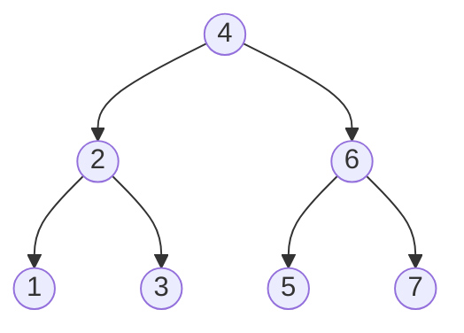
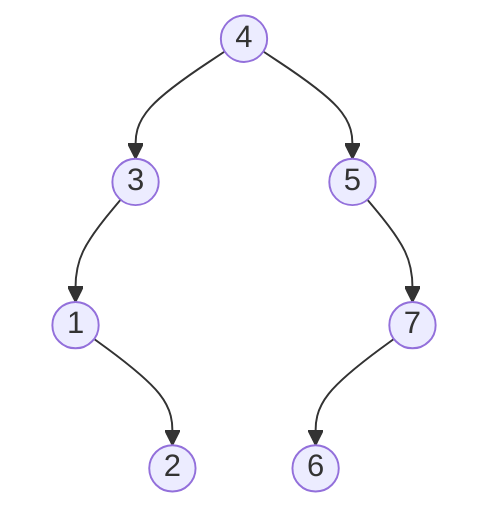

### Counting binary trees

I was thinking about of the problem of balancing a binary tree, and my mind stumbled across to the question "How many different binary trees with labelled nodes can you make without changing the traversal order?". After figuring out the answer myself I realized that the numbers of such binary trees are just [Catalan numebrs](https://en.wikipedia.org/wiki/Catalan_number) (I was not really into combinatorics - now I am).

For example, the following has traversal order 1->2->3->4->5->6->7

But the following also has the same traversal order:

If we want to maintain the given traversal order while creating with different binary trees, we are essentially counting the number of binary trees that can represent the array $1, 2, 3, \dots, n$.

To construct a binary tree from the given array, there are 2 ways to do so:

### Picking roots in subtrees

To create a tree with the array, let's start with picking one of the items as root. Let's say we pick 3 here:

Now every items before 3 should appears in the left subtree due the way of how traversal order works. Similar for the right subtrees. In order to construct the left/ right subtree, we need to pick the root for them:

Continue in the same manner, we will get the whole binary tree:

It is not hard to see the recursion in this process. After we pick a root, we need to pick the root for the subtrees, which are the same problem with smaller number of nodes. The sizes of the subtrees depends on the choice of the root. By running through all choices of root we have:

> Let $f(n)$ be the number of binary trees desired.
> 
> Then $f(n) = \sum\limits_{i=0}^{n-1} f(i)f(n-1-i)$

### Picking legs

Draw $n$ nodes with their 2 "legs". There are totally $2n$ "legs". Each node has a properties called "has_parent" to keep track of the existence of parent for each node. Initally they are all false. We perform the following:

1. Define the following operations of a node:
    a. Pick a leg: the leg will be *occupied* and we have to attach a node to this leg. The node being attached cannot be the *root* and cannot have a parent. Set the "has_parent" to true for the attached node. Note that the choice of node being attached is not relevant as the nodes are unlabelled.
    b. Nullify a leg: the leg will be *occupied* but we don't attach a node to it.
2. Pick a node and mark it as the root. Set the "has_parent" to true. Pick one leg of it. 
3. Pick a node which has at least one leg not occipied and either pick a leg or nullify a leg of it.
4. Do step 3 until we have picked $n-1$ legs in total.

By this process we enumerate all possible binary trees, except some duplicates: In step 2 we picked a node as the root and force it to have at least 1 leg picked, however the nodes should indifferent and the root picking process broke this. As there are $n$ way to pick a root, we should divide the number of possible binary trees by $n$ for deduplication.

To see the number of binary trees generated by this process, note that there are $2n$ legs to be picked, and we pick $n-1$ of them. Hence there are $\binom{2n}{n-1}$ of them. Dividing it by $n$ gives us $\frac{(2n)!}{(n)!(n+1)!}$ which is the closed form of Catalan numbers.

Finally note that the number of distinct unlabelled binary trees is the same as distinct labelled binary trees with a given traversal order - there is only 1 way to fill in labels into the nodes such that they match the given traversal order. 